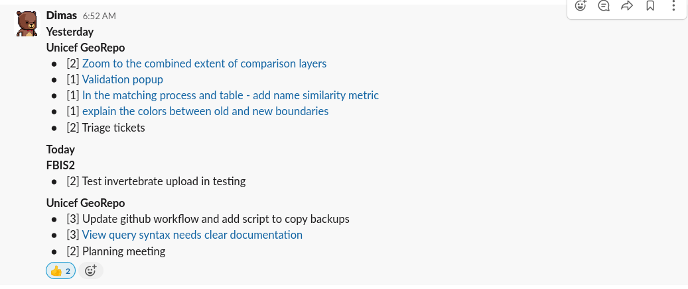
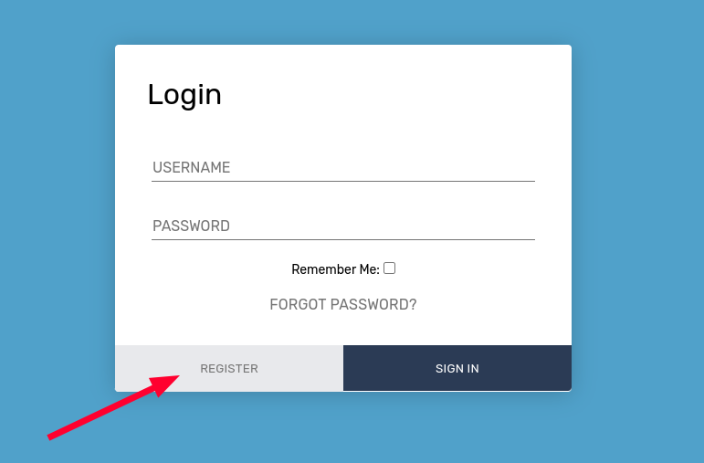
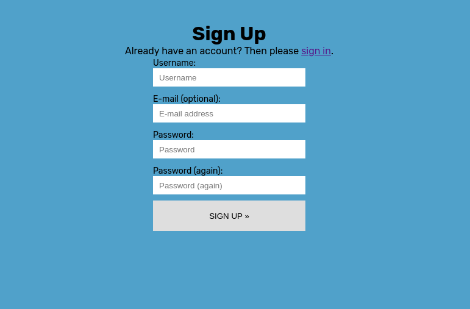
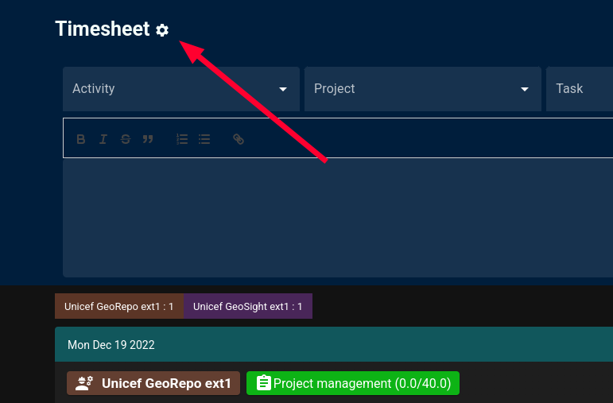
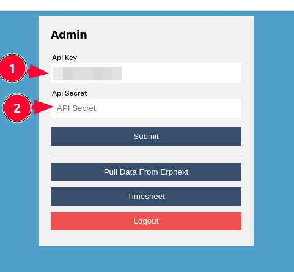

# Your daily workflow at Kartoza

## Starting your day

The activities for your day are determined by:

1. Which project you are working on, as listed in the company-wide project gantt chart / sheet. Normally we try to have you work on a single project per day to reduce cognative friction as you context switch from one project to another.
2. The scrum board / project board for that day's project. The list of sized tickets should be implemented sequentially, from the top of the 'this sprint' column, down to the bottom.

## Story points

Your issues closed in GH should equate to a day or more (assuming some tasks will be quicker than estimated) of GH issues sizes. Before working on any issue it should be sized. Any issue deemed to be larger than 1 day of work should be split into smaller issues.

## Standups

Your daily stand ups should be written like this:

--------

### Yesterday

**Project: Flux Capacitor Enlargement**

* [Size 4] Closed <https://github.com/fcap/foobar/issues/123> - Add transparency to map
* [Size 4] Closed <https://github.com/fcap/foobar/issues/124> - Add transparency to legend
* [Size 2] WIP <https://github.com/fcap/foobar/issues/125> - Add transparency to widgets

**Project: Kartoza**

* [Size 1] Water cooler - outed @Rudolf as a serial imposter

### Today

**Project: Flux Capacitor Enlargement**

* [Size 8] <https://github.com/fcap/foobar/issues/128> - Render flux capacitor on map

### Blockers

* Waiting for client to respond with clarification request on <https://github.com/fcap/foobar/issues/130>

--------

Here is an example from our Slack of a beautifully presented standup up - yours should look like this too!

## Running your timesheets

We run our own timesheet application (thanks Dimas!) at [timesheets.kartoza.com](https://timesheets.kartoza.com/) - and in our ERP Next platform. The timesheets.kartoza.com is preferred since it has many niceties to make your time tracking more efficient. We bill our customers in 15 minute increments, rounded down or up as appropriate. This is aggregated across the day. That means if you e.g. log 2h12 minutes on one cost center for a client and 1h00 minutes on another cost center for the same client, the client will be billed 3h15min for the day's work.

The descriptions in your timesheets should be defensible, terse descriptions of work with links to GitHub issues. Defensible means that if a client were ever to ask you to justify how you spent your time in an invoiced line item, we can refer back to the description and see references to tickets worked on and the story points associated with the work.

**Your timesheets should match the projects planned on the planner sheet.**

## Setting up the timesheet account

Step 1: Go to <https://timesheets.kartoza.com>

Step 2: Choose register to create your account:

Step 3: Complete the form to create your account:

Step 4: Use the cog menu to get to the settings panel

Go to ERP Next to get your API keys by looking in your user profile e.g.

<https://kartoza.erpnext.com/app/user/YOURUSERNAME%40kartoza.com>

Back on the timesheets app, in the form that appeared from the cog menu, enter your API key and secret:

Now use the button (1) to pull data from erpnext then the button (2) to return to your timesheet.

