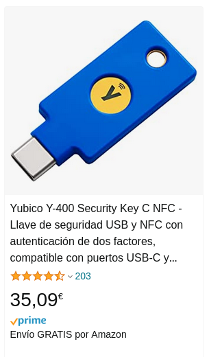
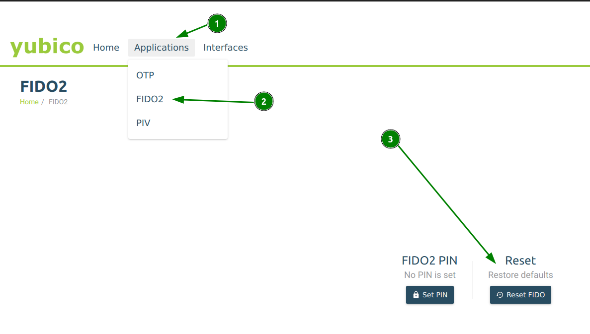
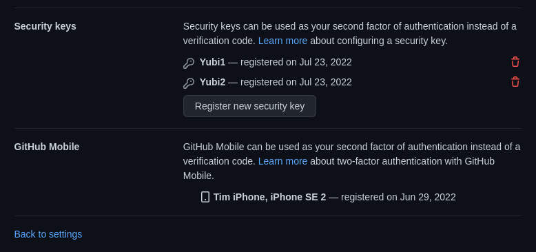
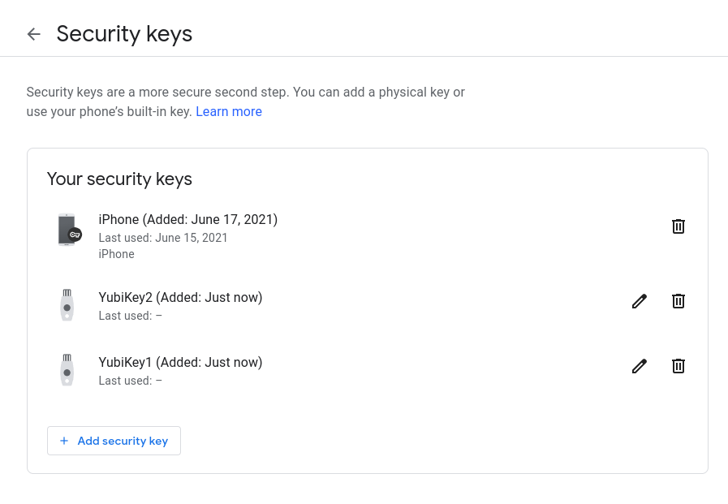
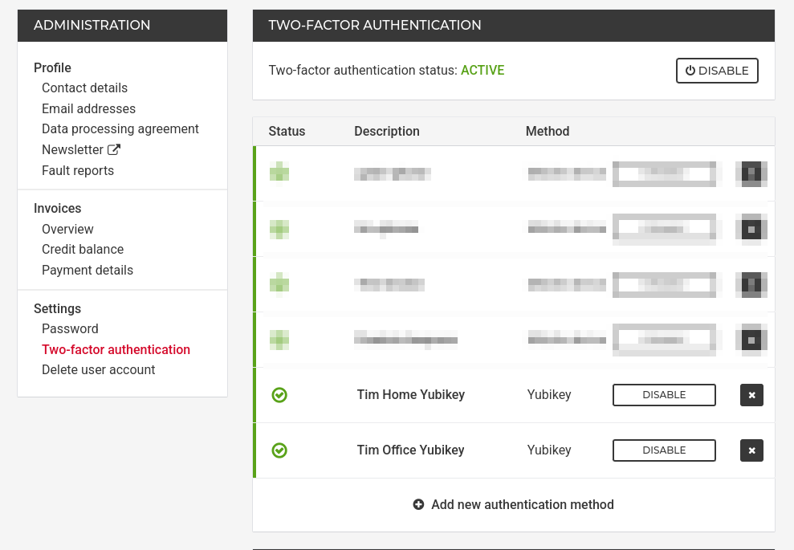
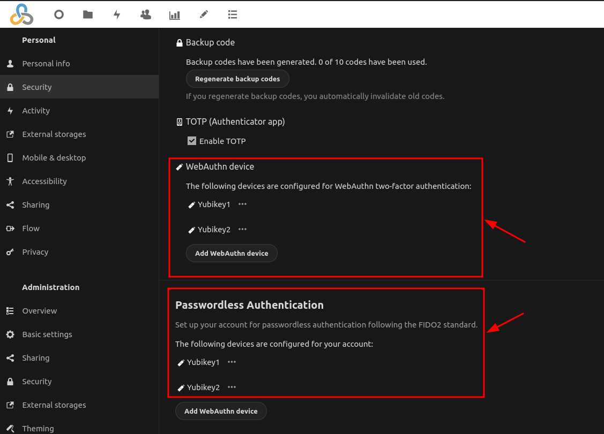

# Setting up your PC

## Hardware

Here are the standard minimum guidelines for hardware for Kartoza Staff:

Laptops are preferred in general. Many of our staff work in areas with unreliable power supply and so you need to be able to work offline for at least four hours.

### Admin Staff

Admin staff tend to have less demanding activities which is reflected in the hardware:

Feature | Requirements
--------|--------------
RAM | 8GB
Hard Disk | 256GB SSD
Internal Display | 1920 x 1080 or better
External Display | 1920 x 1080 or better
Operating System | Ubuntu LTR
CPU | Mid range e.g. i5 4 core or Athlon equivalent

### GIS Staff

GIS Staff need laptops with good storage capacity for accommodating large GIS datasets, and good processing power to perform time-consuming analysis quickly.

Feature | Requirements
--------|--------------
RAM | 16GB
Hard Disk | 1TB SSD
Internal Display | 1920 x 1080 or better
External Display | 1920 x 1080 or better
Operating System | Ubuntu LTR
CPU | Mid range e.g. i5 4 core or Athlon equivalent

### Developer Staff & Devops

Developer Staff and Devops need laptops with processing power so they can run multiple containers to emulate the deployment environment for their apps. Developer staff tend to have more technical skills and may install their own preference of Operating System if they prefer.

Feature | Requirements
--------|--------------
RAM | 16GB
Hard Disk | 500GB SSD
Internal Display | 1920 x 1080 or better
External Display | 1920 x 1080 or better
Operating System | Ubuntu LTR or user preference
CPU | Mid range e.g. i5 4 core or Athlon equivalent

### Additional Hardware

All staff should in addition be issued with:

* **A USB headset.** USB headsets include their own DSP (Digital Sound Processor) and will generally have a better sound quality than an analogue headset.
* **An external disk for backups.** This should again be encrypted. The disk should be 4x the size of the hard disk. Use Déjà Dup Backups to run automatic backups on a nightly basis.
* **A kensington lock.** This should be used whenever the laptop is left unattended in a public place (i.e. anywhere other than your home).
* **A Yubikey.** This will be used to authenticate to Google Apps for Domains (Via Yubikey TOTP), BitWarden, your local PC login (via FIDO2) and other services such as NextCloud. Each staff member should be issued with two of these devices and the second should be stored at home in a safe place in case the first is lost. One of following models are suggested:





## Base Install Requirements

Every staff computer should have the following as a minimum:

* Encrypted disk. Under Linux use LUKS when you install to encypt at a minimum your home partition. Ideally your whole system should be encrypted since if you run docker, postgres and other similar services, you have exposure to data loss if someone steals your PC.

* Strong password. The password for your account should not be used for any other system.

* Yubikey PAM Integration. We recommend as an added precaution to set up the YubiKey PAM module which will require to touch your YubiKey after typing in your system password to autheticate. The process for doing this is described [here](https://support.yubico.com/hc/en-us/articles/360016649099-Ubuntu-Linux-Login-Guide-U2F).

> Yubkey locks the FIDO2 Pin by default. You should follow  these steps to unlock it first before running through the above tutorial. Note they assume you have installed the PPA in the above tutorial above first.

Install the YubiKey GUI manager, then use the options as shown below.

```
sudo apt install yubikey-manager-qt
ykman-gui
```



## Online Accounts

You need to have online accounts with the following services:

* [GitHub](https://github.com) - then set up your YubiKey as your 2FA [here](https://github.com/settings/two_factor_authentication/configure). As a backup 2FA you should use the GitHub mobile app. Note that using SMS for 2FA is not considered secure.



* [Google](https://myaccount.google.com/). Set up your YubiKey as your 2FA [here](https://myaccount.google.com/two-step-verification/security-keys). As a backup 2FA you should use the Google mobile app. Note that using SMS for 2FA is not considered secure.



* [Hetzner](https://hetzner.com). If you are a staff member with permission to access Hetzner, set up your YubiKey as your 2FA [here](https://accounts.hetzner.com/tfa). Note that using SMS for 2FA is not considered secure.



* ERNext. Our admin team will provision an account for you.

* NextCloud. Our admin team will provision an account for you. [NextCloud](https://cloud.kartoza.com/). If you are a staff member with permission to access Hetzner, set up your YubiKey as your 2FA [here](https://cloud.kartoza.com/settings/user/security). Note that using SMS for 2FA is not considered secure.




## Skills
