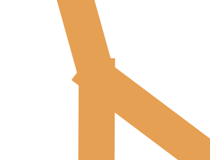

# Guidelines on how to create effective cartography

This section is a collection of rules and mantras used by Kartoza to Make beautifull and effective catography.

## Symbol levels

Symbol levels tell QGIS in what order to draw the features symbols when there are multiple levels.

## Common issues in cartography

No. | Image | Description
----|-------|------------------------
1 |  | Dont let labels overlap features.
2 |  | Make sure that major roads cover minor roads.
3 |  | Set you canvas scale to the scale you plan to print at (1) then lock it (2) then when you zoom in and out with your scroll wheel it will zoom into pixels at the fixed scale (3).
4 |  | Don't include roads on your map that end abruptly unless this indeed reflects reality.
5 |  | Generally you should use a round cap style for your roads to avoid issues of the road cap extending beyond intersecting roads.
6 |  | As a general rule, points should be drawn above polygon and line features.

Template row:
1 |  |
