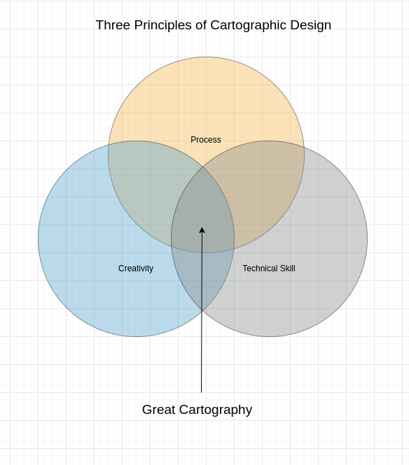
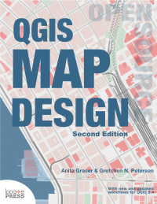
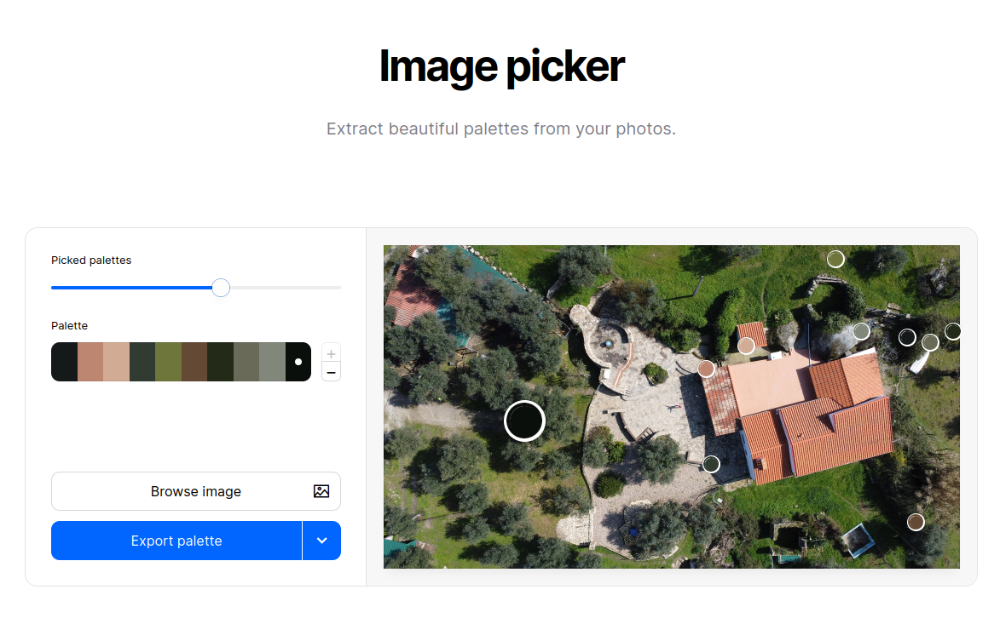
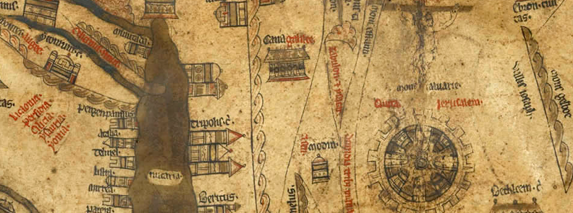
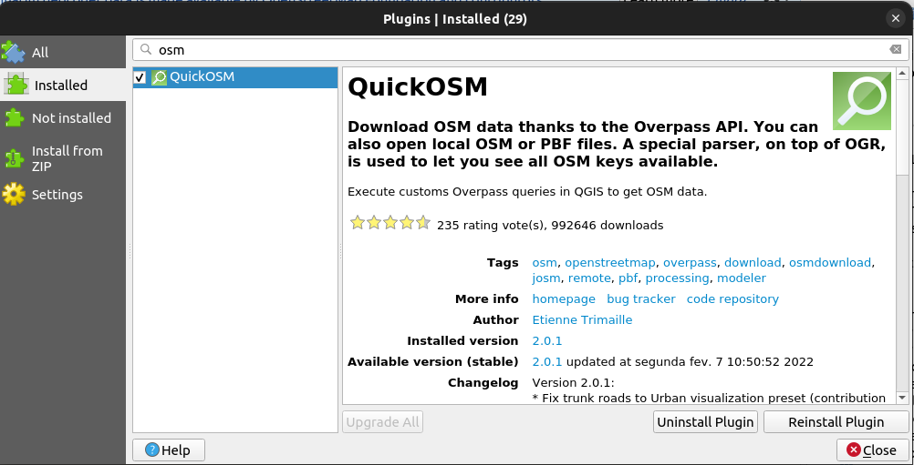
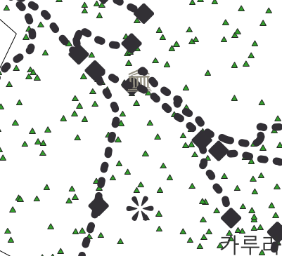
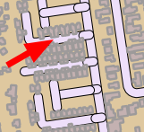
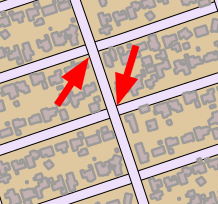
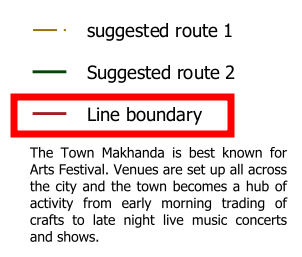
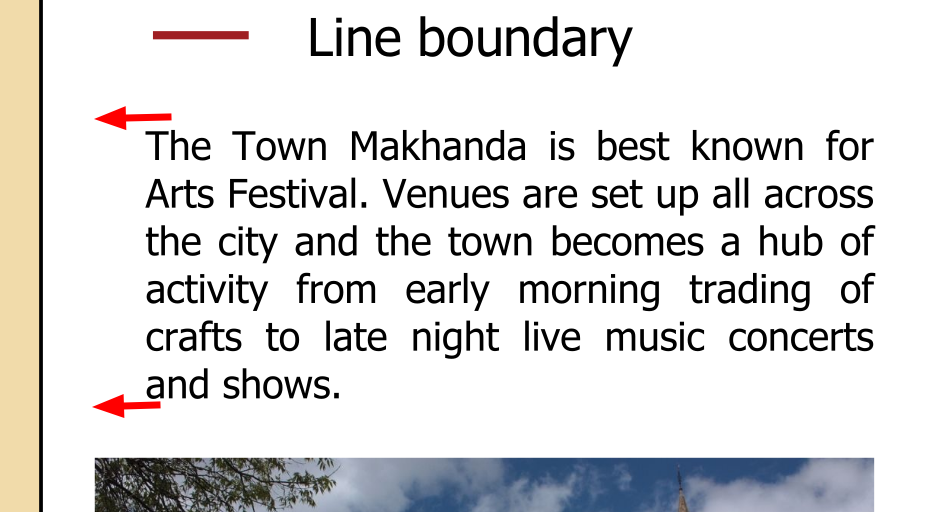

# Cartography Guidelines

This section is a collection of rules and mantras used by Kartoza to Make beautifull and effective catography.

## Tim's three principles

In the above image we can see a framework for you to use to develop your cartography skills. There are three principles you should understand in order to make great cartographic products. The principles are an adaptable construct designed to help you make maps which respect your user's intelligence and surprise, excite and delight them.

1. **Process:** This is definition of a standardised, rigourous set of steps that should be followed by for yourself and / or your co-workers to adhere to when developing your product. Process is the unexciting stuff that happens in the background. Your process should be defined as a nest list of statements. The best way to explain is by an example:
    1. All map fonts should be at least or larger than 6pt.
    2. All map symbols should be at least or larger than 3mm.
    3. All third party map symbols should available published under an open license.
    4. .... etc. ....
The development of the process is to have the creation of your map repeatable from one end to another, and to be able to work collaboratively with colleages in a consistent way.
2. **Technical Skill**: This is the process whereby you learn the capabilities of the software (e.g. QGIS) as thoroughly as possible in order to be able to articulate any idea you or others may have as a cartographic expression. Technical skill is a process of continual learning and acquiring it should commence with the development of a high level framework of the cartographi system and then progress with a deeper and deeper understanding of all of the constituent parts.
3. **Creativity:** This is the hardest (and sometimes impossible) to imbue in a cartographer. When you lack personal creativity to come up with great map designs, you should (ethically) build on the work of others through emulation. By ethically we mean, crediting the inspiration of your designs to the correct person, asking permission when needed, and being sensitive to the livelhood and reputation for whoever you derive your work from. When you do have a creative side, you should be using it to inform the process and learning of technical skills so that you can articulate your vision in the cartography you produces.

We should stress that all rules you or others create can be broken if they are broken with intention. That is to say, if you decide a 3 point font symbol is critical for the artistic or technical vision, you should not be afraid to make such a decision. What we want to avoid is unintentional breaking of your own rules as it will lead to a less professional looking product.

The relative size of your circles for process versus creative versus technical abilities will likely differ widelines. Your job is to strive in your personal journey as a cartographyer to bring them into good proportion and to grow the areas which are under developed. There is a lot of theory out there on cartographic design, but I really recommend reading [this wikipedia page: https://en.wikipedia.org/wiki/Cartographic_design](https://en.wikipedia.org/wiki/Cartographic_design) and also reading the QGIS Map Design book by Anita Graser and Gretchen Peterson ([available at https://locatepress.com/book/qmd2](https://locatepress.com/book/qmd2)). .

## Steps to preparing a map

1. **Choose your locality.** Perhaps you have a client or an assignment which will determine the place. Or perhaps you have the feedom to choose the place yourself.
2. **Choose the scale for your map.** Again this may be client driven based on a specification or you might have the freedom to choose yourself. But decide up front what scale you will view the map at as it will influence all your decisions as you develop your map. In some cases you may be asked to make a variable scale product e.g. for a web map that can be zoomed in and out. If you are producing a variable scale map, determine which scale ranges and intervals will be used. For example, OpenStreetMap defines [standard scale intervals](https://wiki.openstreetmap.org/wiki/Zoom_levels) which are used by many web web mapping toolkits. If you are able to choose your own scale, try to choose a humanistic scale e.g. 1:50 0000, 1:5000 etc.
3. Assuming you are preparing a fixed scale map, **define the extent of your map**. This may be determined by the print page size or by client factors. In some cases, the size of the print medium may influence the scale of your map. For example, you may be printing to an A4 map and need to choose a scale that allows you to see the whole town or area of interest.
4. **Determine which data layers to feature in your map**. Some typical examples will be roads, buildings, rivers, water bodies, points of interest etc. Make a list and then go out and procure your data. For each dataset your find, keep note of the following details in a spreadsheet or notes file:
    1. Date of download
    2. Source (name of person or organisation)
    3. Attribution (citation for the data)
    4. URL
    5. Notes
5. **Determine the purpose of your map.** Every map has a story to tell. Maybe you want to show a tourist around your city? Perhaps it is a narrative about crime or socio-economics. Try to create a short narrative like you were telling a friend about visiting the place in your map to create a sense of 'feel' about the place.
6. **Plan your colour palette.** Overwhelming your reader with many, jarring colours won't help them to interpret your map well, not will it make for an aesthetically pleaseing experience. If you are not good at working with colours, find a photo of a key feature of the area and lift colours out of the image until you have about 8 to 10 colours of different hues and intensities. Or check out one of the many online sites like [coolers.co](https://coolors.co/image-picker)  .
7. **Choose a style.** There are many amazing cartographic styles out there. Do you want something technical? Cartoony? Medieval looking? Find an example of a similar style to what you have in mind and look at what visual elements they use to cartography style.  - Medieval Mappa Mundi map from the 1300s ([source - Wikipedia](https://en.wikipedia.org/wiki/Mappa_mundi#/media/File:Hereford-Karte.jpg))
8. **Plan your layout.** If you are making a print map, it can be useful to roughly plan where all the elements such as map, legend, photos or graphics etc. will appear on your layout. That will influence some decisions in your cartography and will help you to organise your work plan.
9. **Create a set of guidelines.** Create some rules for yourself to follow. Life gets a lot easier when you have a framework to construct your work on than when you are just 'winging it'.
10. Use the **QGIS QuickOSM Plugin** to quickly establish a baseline set of layers for your map. .

## Common issues in cartography

No. | Image | Description
----|-------|------------------------
1 |  | Dont let labels overlap features.
2 |  | Make sure that major roads cover minor roads.
3 |  | Set your canvas scale to the scale you plan to print at 1️⃣ then lock it 2️⃣ then when you zoom in and out with your scroll wheel it will zoom into pixels at the fixed scale 3️⃣.
4 |  | Don't include roads on your map that end abruptly unless this indeed reflects reality.
5 |  | Generally you should use a round cap style for your roads to avoid issues of the road cap extending beyond intersecting roads.
6 |  | As a general rule, points should be drawn above polygon and line features.
7 |  | Use a font that matches the language of your map.
8 |  | Use symbol layers to place a solid background behind symbols which are transparent and are getting lost in the background.
9 |  | Do not use transparency inappropriately. Features like dams should be usually rendered with a solid fill.
10 |  | Avoid visual clutter in your map. If there are too many features visible with similar contrast  your user will quickly become overwhelmed.
11 |  | Avoid overlapping features that don't naturally overlap.
12 |  | Use layer symbol levels for multilayer symbols to prevent elements of the style overlapping.
13 |  | Don't use legend items that are not meaningful.
14 |  | Use call out labels when they risk covering important features on the map.
15 |  | Don't let line or polygon features obscure point symbols.
16 |  | Make sure the sizes of components on your map are balanced.

[//]: # (This is a comment it wont be rendered if you leave a blank line after)

[//]: # ( Template row: )

1 |  |

[//]: # ( Template numbers: )

[//]: # ( 0️⃣ 1️⃣ 2️⃣ 3️⃣ 4️⃣ 5️⃣ 6️⃣ 7️⃣ 8️⃣ 9️⃣ 🔟 )
