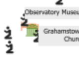
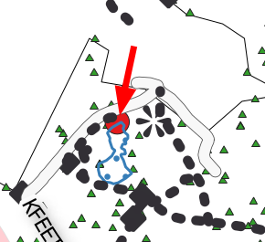
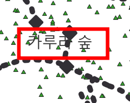

# Cartography Guidelines

This section is a collection of rules and mantras used by Kartoza to Make beautifull and effective catography.

## Common issues in cartography

No. | Image | Description
----|-------|------------------------
1 |  | Dont let labels overlap features.
2 |  | Make sure that major roads cover minor roads.
3 |  | Set your canvas scale to the scale you plan to print at 1️⃣ then lock it 2️⃣ then when you zoom in and out with your scroll wheel it will zoom into pixels at the fixed scale 3️⃣.
4 |  | Don't include roads on your map that end abruptly unless this indeed reflects reality.
5 |  | Generally you should use a round cap style for your roads to avoid issues of the road cap extending beyond intersecting roads.
6 |  | As a general rule, points should be drawn above polygon and line features.
7 |  | Use a font that matches the language of your map.
8 |  | Use symbol layers to place a solid background behind symbols which are transparent and are getting lost in the background.
9 |  | Do not use transparency inappropriately. Features like dams should be usually rendered with a solid fill.
10 |  | Avoid visual clutter in your map. If there are too many features visible with similar contrast  your user will quickly become overwhelmed.

[//]: # (This is a comment it wont be rendered if you leave a blank line after)

[//]: # ( Template row: )

1 |  |

[//]: # ( Template numbers: )

[//]: # ( 0️⃣ 1️⃣ 2️⃣ 3️⃣ 4️⃣ 5️⃣ 6️⃣ 7️⃣ 8️⃣ 9️⃣ 🔟 )
